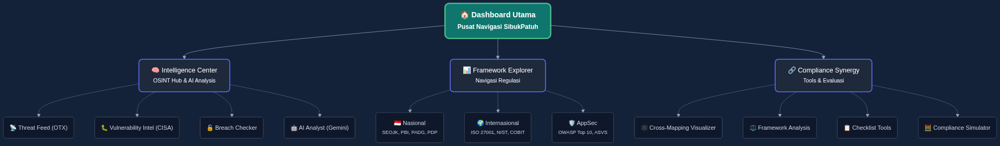

# 🛡️ SibukPatuh - Intelligence & Compliance Dashboard

[](https://vercel.com)
[](https://vuejs.org)
[](https://vitejs.dev)
[](https://ai.google.dev)

**SibukPatuh** adalah platform *Unified Compliance & Threat Intelligence* yang dirancang untuk membedah kompleksitas regulasi IT dan memantau lanskap ancaman siber secara *real-time*. Dikembangkan dengan estetika *high-density dashboard* untuk para praktisi GRC (*Governance, Risk, and Compliance*) dan *Security Analyst*.

---

## ⚠️ Disclaimer Penting

**Konten edukatif — bukan pengganti standar resmi:**

- Data untuk **ISO 27001:2022**, **ISO 37001:2016**, **COBIT 2019**, **NIST CSF**, regulasi Indonesia (seperti **SEOJK**, **PBI**, **PADG**, **UU PDP**), serta panduan **OWASP** adalah **ringkasan edukatif** berdasarkan interpretasi teknis, **bukan** teks hukum resmi.
- Untuk keperluan audit resmi, silakan merujuk pada dokumen yang diterbitkan oleh institusi terkait (BSN, OJK, BI, ISO, ISACA, OWASP).

---

## 🗺️ Arsitektur Aplikasi (Flowchart)

Berikut adalah alur navigasi dan fitur utama dalam aplikasi SibukPatuh:



---

## 🚀 Fitur Unggulan

### 1. 🧠 Intelligence Center (OSINT Hub)
Pusat komando intelijen ancaman yang mengintegrasikan berbagai sumber data global:
- **Threat Feed (OTX AlienVault):** Monitoring *pulse* dan indikator ancaman (IOC) terbaru secara *real-time*.
- **Vulnerability Intel (CISA KEV):** Daftar kerentanan yang telah dieksploitasi secara aktif (*Known Exploited Vulnerabilities*).
- **Breach Checker (Smart Fallback):** Integrasi API BreachDirectory dengan mekanisme **Smart Fallback** otomatis (menggunakan data *mock* jika limit API tercapai) untuk simulasi kebocoran data email.
- **AI Analyst Integration:** Ditenagai oleh **Google Gemini 3 Flash**, memberikan analisis CVE mendalam, rekomendasi mitigasi, dan memetakan dampak risiko terhadap regulasi di Indonesia.

### 2. 📊 Professional Framework Explorer
Navigasi interaktif untuk berbagai standar kepatuhan dengan layout responsif:
- **Nasional:** SEOJK 29/2022, Panduan Resiliensi OJK, PBI 02/2024, PADG 32/2025, UU PDP 27/2022.
- **Internasional:** COBIT 2019, NIST CSF 2.0, ISO 27001:2022, ISO 37001:2016.
- **Application Security (AppSec):** OWASP Top 10, OWASP ASVS.
- **Analogi "Street Smart":** Setiap kontrol dilengkapi dengan penjelasan bahasa santai dan mudah dipahami namun tetap profesional.

### 3. 🔗 Compliance Synergy (Cross-Mapping & Analysis Tools)
Toolkit lengkap untuk membantu memetakan kepatuhan:
- **Cross-Mapping Visualization:** Visualisasi keterkaitan antar framework (ISO, NIST, PBI, dll) menggunakan **D3.js Force-Directed Graph**.
- **Framework Analysis:** Perbandingan *side-by-side* antar regulasi untuk menemukan *overlapping controls* secara otomatis.
- **Checklist Tools:** Alat evaluasi (Gap Analysis) mandiri untuk mengukur tingkat kepatuhan saat ini dan mengekspor laporannya ke bentuk PDF/Word.
- **Compliance Simulator:** Fitur analisis "What-If" untuk menyimulasikan dampak perubahan implementasi kontrol terhadap total skor kepatuhan secara instan.

---

## 📈 Change Log
Lacak pembaruan fitur dan perbaikan bug secara real-time di [CHANGELOG.md](./CHANGELOG.md).

---

## 🛠️ Tech Stack & Arsitektur

### Frontend
- **Vue 3 (Composition API):** Framework reaktif untuk performa tinggi.
- **Pinia:** State management yang ringan dan efisien.
- **Vue Router:** Navigasi client-side yang mulus tanpa refresh halaman (SPA).
- **ApexCharts & D3.js:** Visualisasi distribusi data dan pemetaan graph.
- **Custom CSS:** Estetika *Glassmorphism* dan dukungan responsif *Dark Mode*.

### Backend (Serverless)
- **Vercel Serverless Functions:** Proxy API terintegrasi untuk menangani permintaan eksternal (menghindari CORS dan menyembunyikan API Key).
- **Smart Rate Limiting:** Mekanisme pencegahan *client-side* terhadap indikasi *spamming* permintaan.

---

## 📂 Struktur Project

```bash
sibukpatuh-vue/
├── api/                # Serverless Functions (Breach, CISA, Gemini, OTX, MISP)
├── public/data/        # Framework JSON Datasets (COBIT, PBI, ISO, dll)
├── src/
│   ├── components/     # UI Components
│   ├── views/          # Framework & Intelligence Pages
│   ├── services/       # API Services Logic
│   ├── router/         # Vue Router Configuration
│   └── assets/css/     # Core Design System & Styling
├── vercel.json         # Deployment & Routing Config
└── README.md           # Documentation
```

---

## 🔧 Pengembangan Lokal

1. Clone repositori:
   ```bash
   git clone https://github.com/lintanggraha/sibukpatuh.git
   ```
2. Install dependensi:
   ```bash
   npm install
   ```
3. Setup Environment Variables (`.env`):
   ```env
   VITE_GEMINI_API_KEY=your_key_here
   RAPIDAPI_KEY=your_key_here
   ```
4. Jalankan server dev:
   ```bash
   npm run dev
   ```

---

## 🌐 Deployment

Aplikasi ini dioptimalkan untuk deployment di **Vercel** dengan dukungan otomatis untuk *rewrite rules* agar fitur *refresh* (F5) pada rute aplikasi tetap berjalan mulus (mencegah Error 404).

---
**SibukPatuh** — *Biar update kepatuhan gak ribet.*
